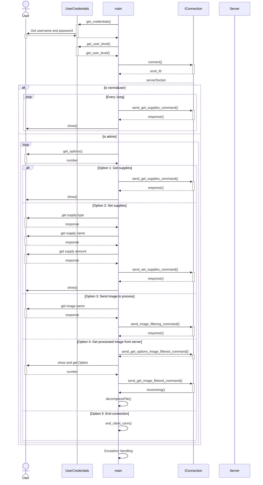

```mermaid
sequenceDiagram
    actor user as User
    participant uc as UserCredentials
    participant main as main
    participant con as IConnection
    participant srv as Server

    main ->> +uc: get_credentials()
    uc ->> +user: Get username and password
    user -->> -uc: 
    uc -->> -main: 
    main ->> +uc: get_user_level()
    uc -->> -main: get_user_level()

    main ->> +con: connect()
    con -->> -main: sock_fd
    con --> main: serverSocket

    alt is normaluser
        loop Every 1seg
            main->>+con: send_get_supplies_command() 
            con-->>-main: response() 
            main->>user: show()
        end
    else is admin
        loop
            main ->> +user: get_options()
            user -->> -main: number
            
            alt Option 1: Get supplies
            main->>+con: send_get_supplies_command() 
            con-->>-main: response() 
            main->>user: show()
            
            else Option 2: Set supplies
            main ->> +user: get supply type
            user -->> -main: response
            main ->> +user: get supply name
            user -->> -main: response
            main ->> +user: get supply amount
            user -->> -main: response
            main ->> +con: send_set_supplies_command()
            con -->>-main: response() 
            main->>user: show()

            else Option 3: Send Image to process
            main ->> +user: get image name
            user -->> -main: response
            main ->> +con: send_image_filtering_command()
            con -->>-main: response() 

            else Option 4: Get processed image from server
            main ->> +con: send_get_options_image_filtered_command()
            con -->> -main: 
            main->> +user: show and get Option
            user -->> -main: number
            main ->> +con: send_get_image_filtered_command()
            con ->> -main: receiveImg()
            main ->> main: decompressFile()

            else Option 5: End connection
            main ->> main: end_client_conn()
            end
        end
    end
    main ->> main: Exception Handling

```
