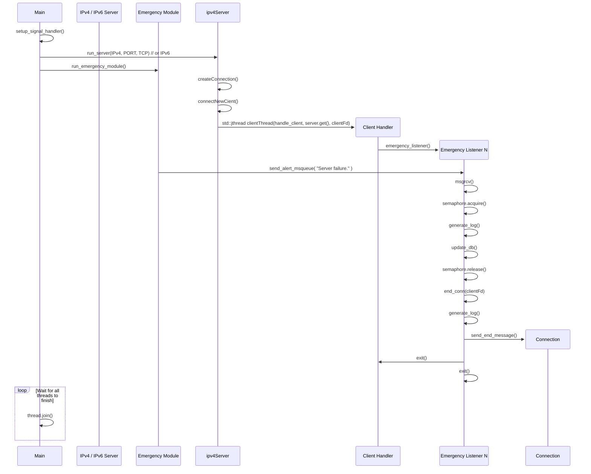

```mermaid
sequenceDiagram
    participant main as Main
    participant ipvXServer as IPv4 / IPv6 Server
    participant emmod as Emergency Module

    main->>main: setup_signal_handler()

    main->>ipv4Server: run_server(IPv4, PORT, TCP) // or IPv6
    
    main->>emmod: run_emergency_module()
    

    ipv4Server ->> ipv4Server: createConnection()
    ipv4Server ->> ipv4Server: connectNewCient()
    create participant clih as Client Handler
    ipv4Server ->> clih:std::jthread clientThread(handle_client, server.get(), clientFd);
    create participant emList as Emergency Listener N
    clih->>emList: emergency_listener()
    emmod ->> emList:send_alert_msqueue( "Server failure." )
    emList->>emList: msgrcv()
    emList->>emList: semaphore.acquire()
    emList->>emList: generate_log()
    emList->>emList: update_db()
    emList->>emList: semaphore.release()
    emList->>emList: end_conn(clientFd)
    emList->>emList:generate_log()
    create participant con as Connection
    emList->>con:send_end_message()
    emList->>clih:exit()
    emList->>emList:exit()

    loop Wait for all threads to finish
        main->>main: thread.join()
    end
```
