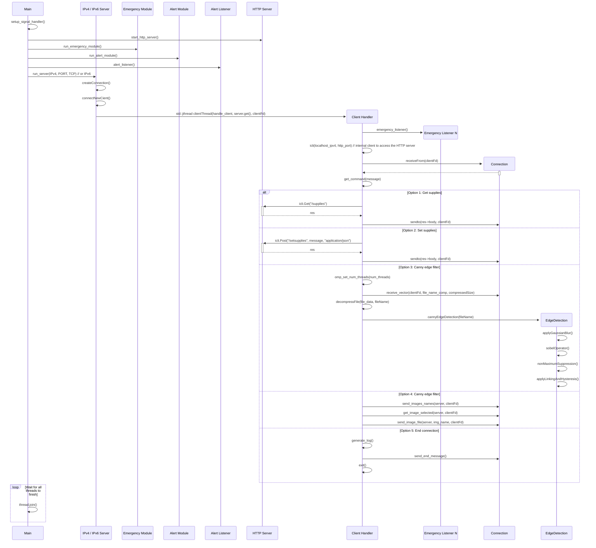

```mermaid
sequenceDiagram
    participant main as Main
    participant ipvXServer as IPv4 / IPv6 Server
    participant emergencyModule as Emergency Module
    participant alertModule as Alert Module
    participant alertListener as Alert Listener
    participant httpServer as HTTP Server

    main->>main: setup_signal_handler()
    
    main->>httpServer: start_http_server()
    
    main->>emergencyModule: run_emergency_module()
    
    main->>alertModule: run_alert_module()
    
    main->>alertListener: alert_listener()
    main->>ipvXServer: run_server(IPv4, PORT, TCP) // or IPv6
    ipvXServer ->> ipvXServer: createConnection()
    ipvXServer ->> ipvXServer: connectNewCient()
    create participant clih as Client Handler
    ipvXServer ->> clih:std::jthread clientThread(handle_client, server.get(), clientFd);
    create participant emList as Emergency Listener N
    clih->>emList: emergency_listener()

    clih->>clih: icli(localhost_ipv4, http_port) // internal client to access the HTTP server

    create participant con as Connection
    clih->>+con: receiveFrom(clientFd)
    con-->>-clih: 
    clih->>clih: get_command(message)

        alt Option 1: Get supplies
            clih->>+httpServer: icli.Get("/supplies")
            httpServer-->>-clih: res
            clih->>con:sendto(res->body, clientFd) 
            
        else Option 2: Set supplies
            clih->>+httpServer: icli.Post("/setsupplies", message, "application/json")
            httpServer-->>-clih: res
            clih->>con:sendto(res->body, clientFd) 
        else Option 3: Canny edge filter
            clih->>clih:omp_set_num_threads(num_threads)
            clih->>con: receive_vector(clientFd, file_name_comp, compressedSize)
            clih->>clih:decompressFile(file_data, fileName)
            create participant canny as EdgeDetection
            clih->>+canny:cannyEdgeDetection(fileName)
            canny->>canny:applyGaussianBlur()
            canny->>canny:sobelOperator()
            canny->>canny:nonMaximumSuppression()
            canny->>canny:applyLinkingAndHysteresis()
        else Option 4: Canny edge filter
            clih->>con:send_images_names(server, clientFd)
            clih->>con:get_image_selected(server, clientFd)
            clih->>con:send_image_file(server, img_name, clientFd)
        else Option 5: End connection
            clih->>clih:generate_log()
            clih->>con:send_end_message()
            clih->>clih:exit()
        end


    loop Wait for all threads to finish
        main->>main: thread.join()
    end
```
